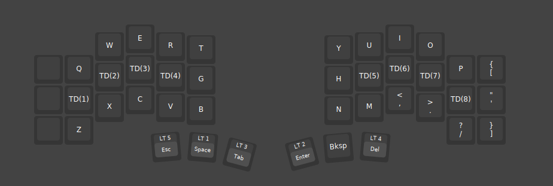
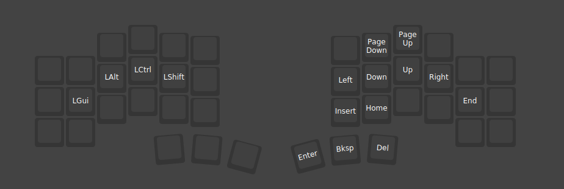
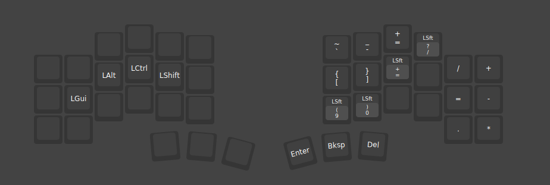
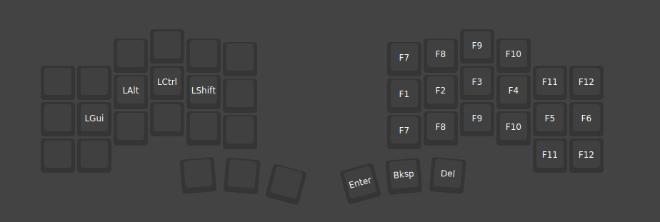

# keymaps
My keymaps for a 42 keys keyboard using Vial

## Layout
Base Layer

Nav Layer

Num Layer

Sym Layer

Misc/Free Layer

Func Layer

## Credits
* based on https://github.com/manna-harbour/miryoku/
